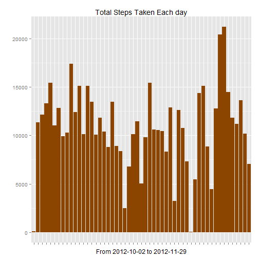
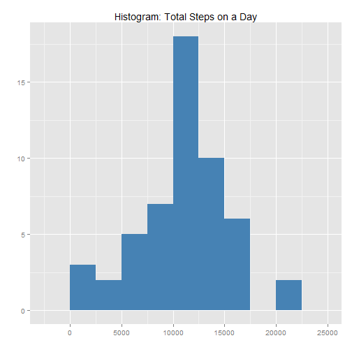
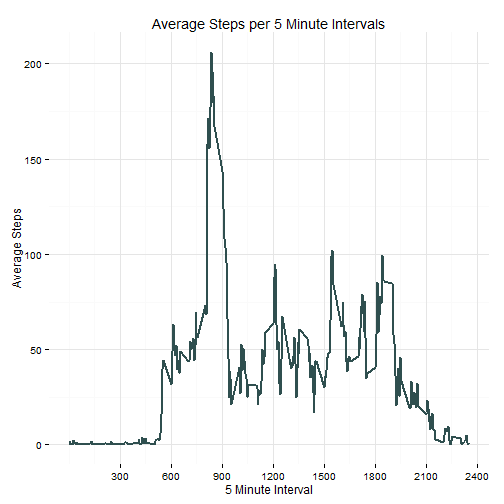
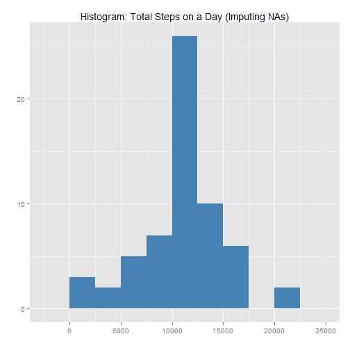
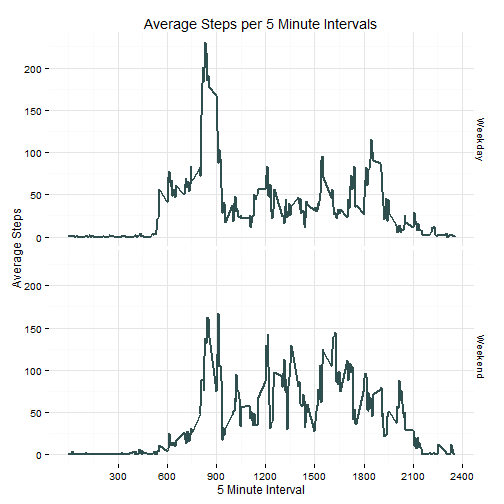

Activity monitoring devices, such as a Fitbit, Nike Fuelband, or Jawbone Up. collects movement data at 5 minute intervals through out the day.

For the purpose of this analyisis we are going to use two months of data from an anonymous individual collected during the months of October and November, 2012 and include the number of steps taken in 5 minute intervals each day.

This data is available for download at my Github account or at cloudfront server:

https://github.com/jorgeh08/RepData_PeerAssessment1/blob/master/activity.zip
https://d396qusza40orc.cloudfront.net/repdata%2Fdata%2Factivity.zip 

##Loading and preprocessing the data

The following script performs the following operations:  
1. Downloads the data from my github repository  
2. Unzips the data into the currect R workind directory  
3. Loads a data frame = data01  
4. Converts time into a POXISLT date/time format (new column)  
5. create a column with the current "weekday" (as factors)  
 

  
##What is mean total number of steps taken per day?  
  
Loading ggplot2 graphics package and summarizing the data per day:  

```r
library(ggplot2)
steps_x_day <- aggregate(Steps_NA ~ Date_Vector+Weekday , data = data_NO_NA, FUN="sum")
```
  
The following chart shows the total steps taken each day:  

```r
a <- ggplot(data=steps_x_day, aes(x=Date_Vector, y=Steps_NA))
a + geom_bar(fill = "darkorange4", stat="identity", ) + labs(title = "Total Steps Taken Each day", x="From 2012-10-02 to 2012-11-29", y="") + theme(axis.text.x = element_blank())
```

 
  
###The following plot is a histogram of the total steps taken on a day:    
  

```r
b <- ggplot(steps_x_day,aes(Steps_NA))
b + geom_histogram(binwidth = 2500, fill = "steelblue") + labs(title="Histogram: Total Steps on a Day", y="", x="")
```

 

##Here is the Mean for the total number of steps taken per weekday  
  
  

```r
aggregate(Steps_NA ~ Weekday, data = steps_x_day, FUN="mean", na.action= "na.omit")
```

```
##     Weekday  Steps_NA
## 1    Monday  9974.857
## 2   Tuesday  8949.556
## 3 Wednesday 11790.750
## 4  Thursday  8212.750
## 5    Friday 12359.714
## 6  Saturday 12535.429
## 7    Sunday 12277.714
```
  
##Here is the Median for the total number of steps taken per weekday  
  


```r
aggregate(Steps_NA ~ Weekday, data = steps_x_day, FUN="median", na.action= "na.omit")
```

```
##     Weekday Steps_NA
## 1    Monday  10439.0
## 2   Tuesday   8918.0
## 3 Wednesday  12069.5
## 4  Thursday   8551.5
## 5    Friday  11829.0
## 6  Saturday  12426.0
## 7    Sunday  11834.0
```
  
  
   
## What is the average daily activity pattern?  

Here we have a time series plot (using ggplot2) of the 5-minute interval (x-axis) and the average number of steps taken, averaged across all days (y-axis)  

```r
steps_x_interval <- aggregate(Steps_NA ~ Interval , data = data_NO_NA, FUN ="mean", na.action ="na.omit")
c <- ggplot(steps_x_interval, aes(Interval, Steps_NA))
c + geom_line(colour = "darkslategray", size = 1) +theme_minimal() + labs(title="Average Steps per 5 Minute Intervals", x="5 Minute Interval", y="Average Steps") + scale_x_continuous(breaks=c(300*1:12))
```

 

The 5-minute interval, on average across all the days in the dataset, that contains the maximum number of steps is inteval # **835**  
  
    
      
      
## Imputing Missing Values  

As any data set, sometimes there are missing values (NAs). In this particular dataset, there is a total of 2304 missing values.  

### Strategy choosen to replace for filling in all of the missing values in the dataset.  
The following script will be used to create a separate dataset and replace each missing value in the "Steps_NA" column by the averare of steps for that particular 5-min interval.  

```r
data_NA_imp <-data_NA


for (i in 1:length(data_NA_imp$Steps_NA)){
        if(is.na(data_NA_imp[i,1])){
                data_NA_imp[i,6] <- mean(data_NA_imp$Steps_NA[which(data_NA_imp$Interval==data_NA_imp[i,3])], na.rm = TRUE)}
        else {data_NA_imp[i,6] <- data_NA_imp[i,1]}
}
names(data_NA_imp) <- c("Steps_NA","Date_Vector","Interval","Date_POSIXlt","Weekday","Steps")
```
  
  
###The new data set without missing values will look like this (1st 10 observations):  

```r
head(data_NA_imp[,c(6,2,3,4,5)],10)
```

```
##        Steps Date_Vector Interval Date_POSIXlt Weekday
## 1  1.7169811  2012-10-01        0   2012-10-01  Monday
## 2  0.3396226  2012-10-01        5   2012-10-01  Monday
## 3  0.1320755  2012-10-01       10   2012-10-01  Monday
## 4  0.1509434  2012-10-01       15   2012-10-01  Monday
## 5  0.0754717  2012-10-01       20   2012-10-01  Monday
## 6  2.0943396  2012-10-01       25   2012-10-01  Monday
## 7  0.5283019  2012-10-01       30   2012-10-01  Monday
## 8  0.8679245  2012-10-01       35   2012-10-01  Monday
## 9  0.0000000  2012-10-01       40   2012-10-01  Monday
## 10 1.4716981  2012-10-01       45   2012-10-01  Monday
```
  
    
### Here is a histogram of the total number of steps taken each day (after imputing Missing Values):  

```r
steps_x_day_NA_imp <- aggregate(Steps ~ Date_Vector+Weekday , data = data_NA_imp, FUN ="sum")
d <- ggplot(steps_x_day_NA_imp,aes(Steps))
d + geom_histogram(binwidth = 2500, fill = "steelblue") + labs(title="Histogram: Total Steps on a Day (Imputing NAs)", y="", x="")
```

 
  
### Here are the Mean and the Median for the total number of steps taken per day (after imputing Missing Values).  
  
##Mean Steps per Weekday:  

```r
aggregate(Steps ~ Weekday, data = steps_x_day_NA_imp, FUN="mean", na.action= "na.omit")
```

```
##     Weekday     Steps
## 1    Monday 10150.709
## 2   Tuesday  8949.556
## 3 Wednesday 11676.910
## 4  Thursday  8496.465
## 5    Friday 12005.597
## 6  Saturday 12314.274
## 7    Sunday 12088.774
```
##Median Steps per Weekday:  

```r
aggregate(Steps ~ Weekday, data = steps_x_day_NA_imp , FUN="median", na.action= "na.omit") 
```

```
##     Weekday    Steps
## 1    Monday 10765.00
## 2   Tuesday  8918.00
## 3 Wednesday 11352.00
## 4  Thursday 10056.00
## 5    Friday 10766.19
## 6  Saturday 11596.09
## 7    Sunday 11646.00
```
  
  
    
    
## Do these values differ from the estimates from the first part of the assignment? What is the impact of imputing missing data on the estimates of the total daily number of steps?  

No, for this particular dataset, the data behaves on a similar way with or without missing values.  
  
    
##Now, let's find out if there are any differences in activity patterns between weekdays and weekends?  
  
This calculation will use the data with the imputed NAs. A new factor variable will be added to the dataset with two levels - "weekday" and "weekend" indicating whether a given date is a weekday or weekend day.    

```r
for (j in 1:length(data_NA_imp$Weekday)){
        if(data_NA_imp[j,5]=="Saturday") {data_NA_imp[j,7] <- "Weekend"}
        else if(data_NA_imp[j,5]=="Sunday") {data_NA_imp[j,7] <- "Weekend"}
                else {data_NA_imp[j,7] <- "Weekday"}
}

names(data_NA_imp) <- c("Steps_NA","Date_Vector","Interval","Date_POSIXlt","Weekday","Steps","Day_Type")

data_NA_imp$Day_Type <- factor(data_NA_imp$Day_Type, levels= c("Weekday","Weekend"))
```
  
The following script summirizes the data by 5 minutes intervals and plots a time series, comparing the 5-minute interval (x-axis) and the average number of steps taken, averaged across all weekday days versus weekend days (y-axis).   
  


```r
steps_x_interval_x_w <- aggregate(Steps~Day_Type + Interval , data = data_NA_imp, FUN ="mean", na.action ="na.omit")
e <- ggplot(steps_x_interval_x_w, aes(Interval, Steps))
e + geom_line(colour = "darkslategray", size = 1) + facet_grid(Day_Type~.) + theme_minimal() + labs(title="Average Steps per 5 Minute Intervals", x="5 Minute Interval", y="Average Steps") + scale_x_continuous(breaks=c(300*1:12))
```

 

