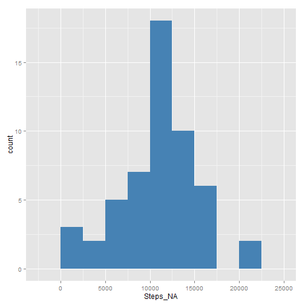
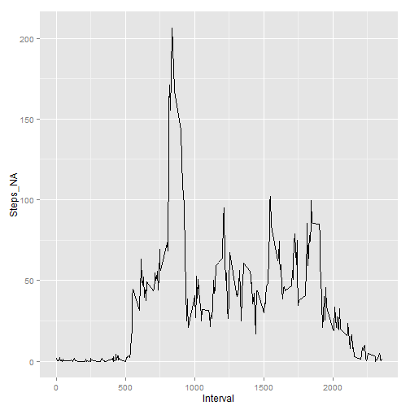
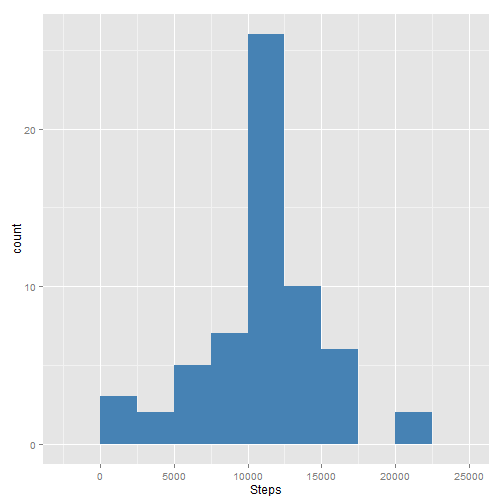
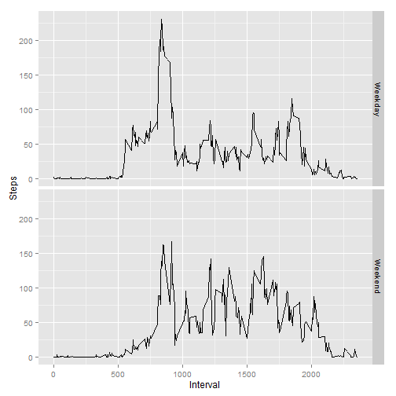

Activity monitoring devices, such as a Fitbit, Nike Fuelband, or Jawbone Up. collects movement data at 5 minute intervals through out the day.

For the purpose of this analyisis we are going to use two months of data from an anonymous individual collected during the months of October and November, 2012 and include the number of steps taken in 5 minute intervals each day.

This data is available for download at my Github account or at cloudfront server:

https://github.com/jorgeh08/RepData_PeerAssessment1/blob/master/activity.zip
https://d396qusza40orc.cloudfront.net/repdata%2Fdata%2Factivity.zip 

##Loading and preprocessing the data

The following script performs the following operations:  
1. Downloads the data from my github repository  
2. Unzips the data into the currect R workind directory  
3. Loads a data frame = data01  
4. Converts time into a POXISLT date/time format (new column)  
5. create a column with the current "weekday" (as factors)  
 


##What is mean total number of steps taken per day?  

###The following histogram shows the total number of steps taken each day  
<The histogram was developed using the ggplot2 package>  


```r
library(ggplot2)
steps_x_day <- aggregate(Steps_NA ~ Date_Vector , data = data01, FUN ="sum", na.action ="na.omit")
a <- ggplot(steps_x_day,aes(Steps_NA))
a + geom_histogram(binwidth = 2500, fill = "steelblue")
```

 

##Here is the Mean for the total number of steps taken per weekday  

```r
aggregate(Steps_NA ~ Weekday, data = data01, FUN="mean", na.action= "na.omit")
```

```
##     Weekday Steps_NA
## 1    Monday 34.63492
## 2   Tuesday 31.07485
## 3 Wednesday 40.94010
## 4  Thursday 28.51649
## 5    Friday 42.91567
## 6  Saturday 43.52579
## 7    Sunday 42.63095
```
##Here is the Median for the total number of steps taken per weekday  

```r
aggregate(Steps_NA ~ Weekday, data = data01, FUN="median", na.action= "na.omit") 
```

```
##     Weekday Steps_NA
## 1    Monday        0
## 2   Tuesday        0
## 3 Wednesday        0
## 4  Thursday        0
## 5    Friday        0
## 6  Saturday        0
## 7    Sunday        0
```

## What is the average daily activity pattern?  

Here we have a time series plot (using ggplot2) of the 5-minute interval (x-axis) and the average number of steps taken, averaged across all days (y-axis)  

```r
steps_x_interval <- aggregate(Steps_NA ~ Interval , data = data01, FUN ="mean", na.action ="na.omit")
b <- ggplot(steps_x_interval, aes(Interval, Steps_NA))
b+ geom_line()
```

 

The 5-minute interval, on average across all the days in the dataset, that contains the maximum number of steps is inteval # 835  

## Imputing Missing Values  

As any data set, sometimes there are missing values (NAs). In this particular dataset, there is a total of 2304 missing values.  

### Strategy choosen to replace for filling in all of the missing values in the dataset.  
The following script will be used to replace each missing value in the steps column by the averare of steps for that particular 5-min interval.  

```r
for (i in 1:length(data01$Steps_NA)){
        if(is.na(data01[i,1])){
                data01[i,6] <- mean(data01$Steps_NA[which(data01$Interval==data01[i,3])], na.rm = TRUE)}
        else {data01[i,6] <- data01[i,1]}
}
names(data01) <- c("Steps_NA","Date_Vector","Interval","Date_POSIXlt","Weekday","Steps")
```

###The new data set without missing values will look like this (1st 10 observations):  

```r
head(data01[,c(6,2,3,4,5)],10)
```

```
##        Steps Date_Vector Interval Date_POSIXlt Weekday
## 1  1.7169811  2012-10-01        0   2012-10-01  Monday
## 2  0.3396226  2012-10-01        5   2012-10-01  Monday
## 3  0.1320755  2012-10-01       10   2012-10-01  Monday
## 4  0.1509434  2012-10-01       15   2012-10-01  Monday
## 5  0.0754717  2012-10-01       20   2012-10-01  Monday
## 6  2.0943396  2012-10-01       25   2012-10-01  Monday
## 7  0.5283019  2012-10-01       30   2012-10-01  Monday
## 8  0.8679245  2012-10-01       35   2012-10-01  Monday
## 9  0.0000000  2012-10-01       40   2012-10-01  Monday
## 10 1.4716981  2012-10-01       45   2012-10-01  Monday
```

### Here is a histogram of the total number of steps taken each day (after imputing Missing Values):  

```r
steps_x_day_NO_NA <- aggregate(Steps ~ Date_Vector , data = data01, FUN ="sum")
c <- ggplot(steps_x_day_NO_NA,aes(Steps))
c + geom_histogram(binwidth = 2500, fill = "steelblue")
```

 

### Here are the Mean and the Median for the total number of steps taken per day (after imputing Missing Values).  

##Mean Steps per Weekday:  

```r
aggregate(Steps ~ Weekday, data = data01, FUN="mean", na.action= "na.omit")
```

```
##     Weekday    Steps
## 1    Monday 35.24552
## 2   Tuesday 31.07485
## 3 Wednesday 40.54483
## 4  Thursday 29.50162
## 5    Friday 41.68610
## 6  Saturday 42.75789
## 7    Sunday 41.97491
```
##Mean Steps per Weekday:  

```r
aggregate(Steps ~ Weekday, data = data01, FUN="median", na.action= "na.omit") 
```

```
##     Weekday Steps
## 1    Monday     0
## 2   Tuesday     0
## 3 Wednesday     0
## 4  Thursday     0
## 5    Friday     0
## 6  Saturday     0
## 7    Sunday     0
```


## Do these values differ from the estimates from the first part of the assignment? What is the impact of imputing missing data on the estimates of the total daily number of steps?  

No, for this particular dataset, the data behaves on a similar way with or without missing values.  

##Now, let's find out if there are any differences in activity patterns between weekdays and weekends?
For this calculation a new factor variable will be created in the dataset with two levels - "weekday" and "weekend" indicating whether a given date is a weekday or weekend day.  

```r
for (j in 1:length(data01$Weekday)){
        if(data01[j,5]=="Saturday") {data01[j,7] <- "Weekend"}
        else if(data01[j,5]=="Sunday") {data01[j,7] <- "Weekend"}
                else {data01[j,7] <- "Weekday"}
}

names(data01) <- c("Steps_NA","Date_Vector","Interval","Date_POSIXlt","Weekday","Steps","Day_Type")

data01$Day_Type <- factor(data01$Day_Type, levels= c("Weekday","Weekend"))
```

The following plot contains a time series plot of the 5-minute interval (x-axis) and the average number of steps taken, averaged across all weekday days versus weekend days (y-axis).   


```r
steps_x_interval_x_w <- aggregate(Steps~Day_Type + Interval , data = data01, FUN ="mean", na.action ="na.omit")
d <- ggplot(steps_x_interval_x_w, aes(Interval, Steps))
d + geom_line() + facet_grid(Day_Type~.)
```

 

